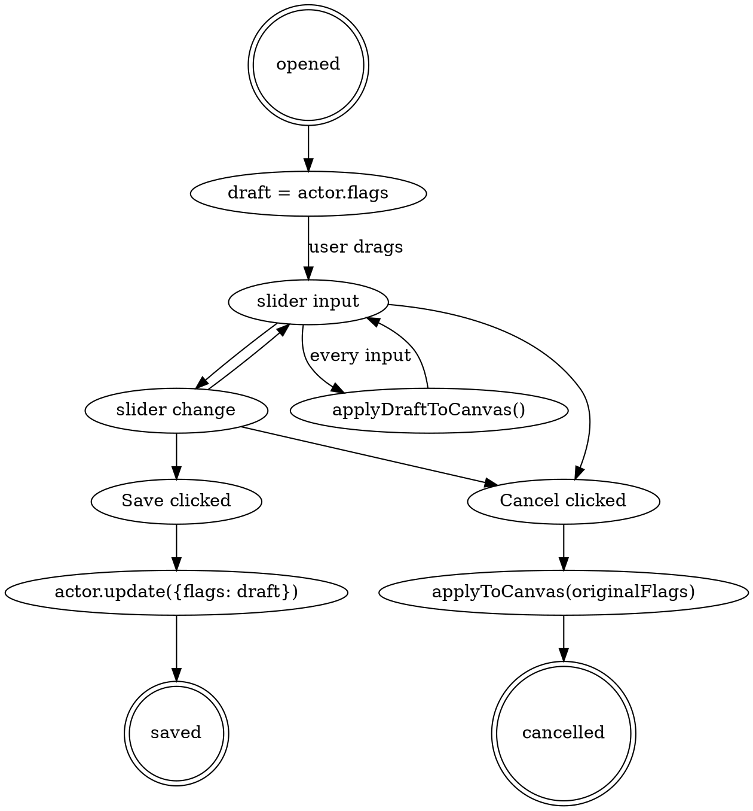

# Plan 2 design — visual customization UI (Restyle + Spawn-dialog expander + motion system)

**Status:** Draft awaiting approval (2026-05-10).
**Author:** Joakim (with Claude Opus 4.7).
**Supersedes nothing.** Amends the canonical spec at `../../../docs/superpowers/specs/2026-05-10-luxurious-summons-design.md` (parent workspace `main` branch — read with `git -C ../.. show main:docs/superpowers/specs/2026-05-10-luxurious-summons-design.md`). Where this doc and the original spec disagree, this doc wins for Plan 2 implementation; the original spec is updated in the same PR.

---

## 1. Scope

**In scope (Plan 2):**

- **Restyle dialog** (`scripts/restyle-app.js` + `templates/restyle.hbs` + `styles/restyle.css`) — opens from companion card; live-updates PIXI filters + motion on the canvas token as sliders move; `actor.update()` only on Save.
- **Spawn-dialog "Customize Visuals" expander** — collapsed by default; same control set as Restyle; preview is the template thumbnail with CSS-filter approximation.
- **Motion system** (`scripts/motion-profiles.js`) — named profiles producing per-frame transform deltas; integrated into `visual-filters.js` apply path.
- **Shimmer filter** (deferred from Plan 1) — PIXI DisplacementFilter with noise texture, intensity-scaled.
- **Performance escape hatches wired** — `enablePIXIFilters: false` falls back to `texture.tint` for hue, skips other filters; `enableDeathAnimations: false` skips death-animation runs.
- **Aesthetic upgrade** — control styling matching the "luxurious gold/wine + subtle steampunk" direction (brass-style slider thumbs, etched track, gilded swatch frames). See §9.
- **Aesthetic-family-driven template defaults** — each template declares an `aestheticFamily` (`"belle-epoque"` warm-natural, or `"hextech"` cold-arcane) that drives its `defaults.visualOverrides` palette + default motion profile + in-scene effect colors. See §2.4.

**Out of scope (deferred):**

- **Template defaults editor** — GM-only Templates tab editing the world-setting `templateOverrides`. Plan 4.
- **Hand-painted token assets / animated WEBM token textures** — Mage Hand, Unseen Servant, etc. Plan 3.
- **Live-Foundry integration of Restyle** — the Plan 2 first deliverable is a standalone HTML preview validating the visual + interaction design. Wiring to live Foundry tokens happens after Plan 1 (v0.1.5) is verified by the friend.

**Why this ordering:** Plan 2 touches `spawn-app.js` + `visual-filters.js`, which are exactly the files Plan 1 might still send back bugs through. By splitting Plan 2 into a **preview phase** (zero Foundry coupling) and an **integration phase** (after v0.1.5 verified), we get visual-design progress now without merge friction.

---

## 2. Spec amendments

### 2.1 Data-model: new `motionOverrides` sibling

Spec §4.1 defines `actor.flags["luxurious-summons"].visualOverrides`. Plan 2 adds a sibling at the same level on the same flag:

```js
actor.flags["luxurious-summons"] = {
  // ... existing fields per spec §4.1 ...
  visualOverrides: { /* unchanged */ },
  motionOverrides: {
    profile: "floating-hand",     // one of the named profiles, "none" to disable
    intensity: 1.0                // multiplier on the profile's amplitudes (0.0 = off)
  }
}
```

**Why sibling, not nested:** filters describe appearance; motion describes behavior. Different concerns, different code paths (filter chain vs. ticker callback), separate persistence makes both easier to reason about. Adding fields to `visualOverrides` would also widen the testable surface of `describeFilters` for state that isn't filter-related.

**Template definitions** in `templates-builtin.js` gain a sibling `motion` field on the template object:

```js
{
  id: "mage-hand",
  // ... existing fields ...
  defaults: {
    visualOverrides: { /* ... */ },
    motionOverrides: { profile: "floating-hand", intensity: 1.0 }   // NEW
  }
}
```

Templates that don't specify `defaults.motionOverrides` get `{ profile: "none", intensity: 0 }`.

### 2.2 Control labels (UX-friendly names, underlying flag names unchanged)

| Spec flag | UI label | Reason |
|---|---|---|
| `saturation` | Vibrance | "Saturation" reads as technical; "Vibrance" is closer to player intuition. |
| `alpha` | Transparency | Same reason; "alpha" is jargon. |
| `hueColor` + `hueIntensity` | Tint + Strength (grouped under "Color") | "Hue" is jargon; the user picks a color and how much of it to apply. |
| `outlineThickness` | Thickness | Plain English. |
| `borderColor` | Card Border | Disambiguates from in-scene outline. |
| `shimmerIntensity` | Strength (within Shimmer group) | Consistent labeling. |

Underlying data model keeps spec field names. Renames live only at the template-rendering layer.

### 2.3 Original-spec patch (to apply in same commit)

Append a line to spec §4.1 acknowledging `motionOverrides` exists; add a `## Plan 2 visual + motion system` section to the Plans 2-5 roadmap pointing to this doc.

### 2.4 Aesthetic family system

Each template object gains an `aestheticFamily` field with two valid values: `"belle-epoque"` (warm/natural/divine — gold/wine/brass palette) and `"hextech"` (cold/arcane/illusion — cyan/silver/rune-blue palette). The field is *declarative metadata* — it informs the default values authored into the template's `defaults.visualOverrides` and `defaults.motionOverrides`, and it categorizes the template for the Plan 4 Templates editor. It does not drive any runtime CSS variable swapping in Plan 2 — the Restyle and Spawn dialogs always use the gold/wine palette regardless of which template is being styled. Per-family dialog accent variation (e.g., hex-rune corner flourishes on hextech templates, fleur-de-lis on Belle Époque) is deferred to Plan 5 polish.

**Template assignments:**

| Family | Templates |
|---|---|
| `belle-epoque` | Find Familiar, Pact of the Chain, Beast Companion, Drakewarden Drake, Steel Defender, Animate Dead, Conjure Animals |
| `hextech` | Simulacrum, Echo Knight Echo, Mirror Image, Mage Hand, Unseen Servant |

**Per-family default palettes** (informing each template's `defaults.visualOverrides`):

| Field | Belle Époque default vocabulary | Hextech default vocabulary |
|---|---|---|
| `hueColor` | warm tones — gold `#c9a14b`, amber `#d68b3c`, bone `#e8dcc4`, blood `#7a1c1c` (template-specific) | cool tones — frost `#88ccff`, cyan `#5cd3e8`, rune-blue `#7ea9ff`, silver `#c8e8f0` (template-specific) |
| `outlineColor` | warm — gold or template-themed warm hue | cold — cyan / rune-blue |
| `shimmer` color (when enabled) | warm-gold flicker | cold-blue arcane shimmer |
| `borderColor` (card) | gold accent default | cyan accent default |
| `motionOverrides.profile` | `idle-breathing` (creatures), warm-tinted `flame-flicker` (Pact-of-the-Chain fiendish familiars) | `flame-flicker` (icy/illusory, e.g. Simulacrum), `mirror-wobble` (Mirror Image), `ethereal-drift` (Unseen Servant, Echo Knight Echo), `floating-hand` (Mage Hand) |

The concrete values for each template's `defaults` are authored individually — the family just informs the palette range. A Find Familiar (owl) might use gold; a Find Familiar (cat) might use amber. Both are Belle Époque.

**Edge case — Animate Dead:** placed in Belle Époque rather than hextech. Reasoning: necromancy in D&D iconography reads as gothic-ornate (Belle Époque adjacent — Hammer Horror, Bride of Dracula) more than crystalline-arcane. The bone/wine palette fits the family. Cross-reference: open question #9 in §12.

---

## 3. Architecture

### 3.1 New files

```
scripts/
├── motion-profiles.js     ← named profile catalog, pure functions (t, intensity) → transformDelta
├── restyle-app.js         ← Restyle dialog (ApplicationV2 + HandlebarsApplicationMixin)
templates/
├── restyle.hbs            ← single-root dialog template with all 8 control groups
├── partials/
│   ├── control-color.hbs       ← reusable color-picker + strength slider
│   ├── control-slider.hbs      ← reusable labeled range slider
│   ├── control-toggle.hbs      ← reusable on/off switch
│   └── control-motion.hbs      ← motion preset radio + advanced disclosure
styles/
├── restyle.css            ← dialog layout + steampunk-luxury control styling
previews/
├── restyle.html           ← standalone HTML preview using actual module CSS
└── restyle-preview.js     ← interaction wiring for the preview (vanilla JS, no Foundry)
tests/
├── lux-motion-profiles.test.js   ← profile output bounds + intensity scaling
└── lux-restyle-draft.test.js     ← draft/save/cancel state transitions (pure logic only)
```

### 3.2 Modified files

| File | Change |
|---|---|
| `scripts/visual-filters.js` | Add `applyMotionToToken(token, motionOverrides)` + ticker registration. Wire `enablePIXIFilters: false` to skip filter build, fall back to `texture.tint`. Implement shimmer (DisplacementFilter). |
| `scripts/spawn-app.js` | Inline "Customize Visuals" expander section. Live-update template thumbnail with CSS filter approximations. Pass overrides into the spawn flow. |
| `scripts/spawn-flow.js` | Plumb per-spawn `visualOverrides` + `motionOverrides` into the spawn payload. |
| `scripts/manager-app.js` | "Restyle" companion-card action opens `RestyleApp` for the actor. |
| `scripts/data-model.js` | Add `motionOverrides` to the companion-record shape validators + flag-write helpers. |
| `scripts/templates-builtin.js` | Add `aestheticFamily: "hextech"` and `defaults.motionOverrides: { profile: "flame-flicker", intensity: 0.6 }` to Simulacrum (low-intensity alpha+brightness shimmer captures the icy-crackle flavor — subtle, not distracting; `mirror-wobble` is reserved for Mirror Image's signature uncanny look). Plan 3 adds family + motion defaults for the remaining 11 templates. |
| `styles/luxurious.css` | Add hextech CSS color tokens (`--luxsum-hex-*`). These are not used by Plan 2 dialogs — they're available for future Plan 5 per-family dialog accents and as a documented palette reference for Plan 3 template authoring. |
| `templates/partials/companion-card.hbs` | Add "Restyle" button to actions row. |
| `styles/manager.css` | Companion-card layout adjustment to accommodate the new action button. |
| `lang/en.json` | All new control labels + tooltips. |

### 3.3 Motion system contract

`motion-profiles.js` exports:

```js
export const motionProfiles = {
  none:             (t, intensity) => ({ dx: 0, dy: 0, dRotation: 0, dScale: 0, dAlpha: 0 }),
  "floating-hand":  (t, intensity) => ({ dy: Math.sin(t * 1.2) * 4 * intensity, dRotation: Math.sin(t * 0.6) * 0.05 * intensity, dScale: Math.sin(t * 0.9) * 0.02 * intensity, dx: 0, dAlpha: 0 }),
  "ethereal-drift": (t, intensity) => ({ dx: Math.sin(t * 0.4) * 3 * intensity, dy: 0, dRotation: 0, dScale: 0, dAlpha: Math.sin(t * 0.5) * 0.08 * intensity }),
  "mirror-wobble":  (t, intensity) => ({ dx: (Math.sin(t * 8) + Math.sin(t * 11.3)) * 0.5 * intensity, dy: (Math.cos(t * 9.1) + Math.sin(t * 12.7)) * 0.4 * intensity, dRotation: 0, dScale: 0, dAlpha: 0 }),
  "idle-breathing": (t, intensity) => ({ dScale: Math.sin(t * 0.8) * 0.03 * intensity, dx: 0, dy: 0, dRotation: 0, dAlpha: 0 }),
  "flame-flicker":  (t, intensity) => ({ dAlpha: Math.sin(t * 14) * 0.05 * intensity + Math.sin(t * 6.5) * 0.03 * intensity, dx: 0, dy: 0, dRotation: 0, dScale: 0 })
};
```

Each profile returns deltas applied on top of the token's base position/rotation/scale/alpha. `t` is seconds since `performance.now()` baseline at sprite spawn. `intensity` is the multiplier from `motionOverrides.intensity`.

`applyMotionToToken(token, motionOverrides)`:

1. If `motionOverrides.profile === "none"` or `intensity === 0`, unregister any existing ticker callback and return.
2. Look up the profile function. If missing, log + fall back to `"none"`.
3. Snapshot the token's base transform (`baseX`, `baseY`, `baseRotation`, `baseScaleX`, `baseScaleY`, `baseAlpha`).
4. Register a ticker callback that calls `profile(t, intensity)`, adds the deltas to the base values, and writes them to `token.position`, `token.mesh.rotation`, `token.mesh.scale`, `token.mesh.alpha`.
5. Store the callback reference on `token.luxsumMotionTick` so cleanup can `ticker.remove(token.luxsumMotionTick)` on actor delete / scene leave / motion-disable.

**Cleanup hooks** to wire: `deleteToken`, `canvasReady` (re-attach to surviving tokens), `updateActor` (re-evaluate motion overrides on flag change).

### 3.4 Draft/Save state machine (Restyle dialog)



`applyDraftToCanvas()` is imperative — no `this.render()` during drag (would cause sticky-thumb per CLAUDE.md). Re-render happens only on dialog close.

---

## 4. UX detail — Restyle dialog

### 4.1 Layout

Compact panel, **360 px wide**, height auto. Draggable. **Position default:** top-right of viewport. (Spec §6.7 says the canvas IS the preview, so the dialog must not occlude the token. The user can drag if needed.)

### 4.2 Control groups (top-to-bottom order)

1. **Color** — color picker (HTML5 `<input type="color">` styled with gilded frame) + Strength slider 0–100%.
2. **Tone** — Brightness slider 0–200% (default 100%), Vibrance slider 0–200% (default 100%).
3. **Visibility** — Transparency slider 0–100% (default 100%).
4. **Outline** — toggle switch + (when enabled) color picker + Thickness slider 0–8 px.
5. **Shimmer** — toggle switch + (when enabled) Strength slider 0–100%.
6. **Motion** — preset radio (Off / Subtle / Default / Lively). Disclosure arrow opens Advanced section with profile dropdown + Float / Sway / Pulse sliders.
7. **Naming** — Prefix text input + Suffix text input.
8. **Card** — Card border color picker (gilded frame).

Each group has a Cinzel-styled title with a thin gold underline. Groups separated by ornate dividers (a thin gold rule with center fleur-de-lis).

### 4.3 Footer

Three buttons in a single row:

| Position | Button | Action |
|---|---|---|
| Left | Reset to template defaults | Copies `template.defaults.{visual,motion}Overrides` into `draft`, re-applies to canvas. Save still needed to persist. |
| Right | Cancel | Restores canvas to original-on-open state, closes dialog. |
| Right | Save | Writes `draft` to actor flags, closes dialog. |

Save button uses the accent fill (`var(--luxsum-accent)` on `var(--luxsum-bg)`); Cancel and Reset are outlined.

### 4.4 Live-preview rules (per spec §6.7)

- Slider `input` event → mutate `draft`, call `applyDraftToCanvas()` → updates PIXI filter chain + motion ticker.
- Slider `change` event → no special action (the dialog doesn't re-render mid-edit; commit happens at Save).
- Text input `input` event → debounce 300 ms, then apply name prefix/suffix to canvas token's nameplate (does NOT touch actor name).
- Color picker `input` event → mutate `draft`, re-apply filters.
- Toggle switch change → mutate `draft`, re-apply.

**Why no `actor.update()` on every `change`:** spec §6.7's prose can be read either as "persist on release" or "preview on release"; we choose preview-only on release because actor flag writes trigger socket round-trips + every player's `updateActor` hook firing. With 4–8 sliders being dragged in sequence, that's a flood. Save-button commit batches it into one write.

### 4.5 Open behavior

- Opens with `draft` initialized from `actor.flags["luxurious-summons"]`.
- Snapshot `originalFlags` for Cancel revert.
- Apply current canvas state — no-op since the canvas already shows the actor's current visual.
- Focus the dialog (keyboard accessibility), but don't auto-focus any input (avoids accidental scrolling).

### 4.6 Close behavior (X button)

Treated as Cancel — restore canvas, no persistence. If the user wants to keep, they click Save.

This is opinionated. An alternative is "X = save-current-as-implicit-commit" but that's surprising; better to require an explicit gesture.

---

## 5. UX detail — Spawn dialog expander

### 5.1 Layout

Inline `<details>` section between the source selector and the footer of the existing `spawn.hbs`. Summary: "Customize visuals". Collapsed by default.

When expanded, shows:

1. Template thumbnail (current `` from `spawn.hbs`) re-rendered with CSS filters approximating the PIXI chain. Top-left of expander.
2. Same 8-group control set as Restyle, vertically stacked. Compact spacing (less generous than Restyle dialog since real estate is tighter).

### 5.2 CSS-filter approximation

PIXI filters don't run on a standard ``. We approximate:

| PIXI effect | CSS approximation |
|---|---|
| `hueColor` + `hueIntensity` | `filter: hue-rotate(<degrees>)` where degrees derives from the color picker hue, intensity controls a blend with a colored overlay (`background-color: <tint>; mix-blend-mode: color; opacity: <intensity>;`) on a wrapper div |
| `saturation` | `filter: saturate(<value>)` |
| `brightness` | `filter: brightness(<value>)` |
| `alpha` | `filter: opacity(<value>)` |
| `outlineColor` + `outlineThickness` | `filter: drop-shadow(0 0 <thickness>px <color>)` (one or two stacked for thicker outlines) |
| `shimmer` | CSS keyframe animation pulsing brightness/contrast — not pixel-accurate but conveys "shimmery" |
| `motion` | CSS keyframe animation matching the profile's general shape (translateY-bob for floating-hand, etc.) |

**Disclosure:** label the expander preview as "approximate preview — final look settled on placement." Sets the right expectation.

### 5.3 Apply on Place

The Place button uses the in-memory overrides for the new spawn (not the template defaults). Plumbed via `spawn-flow.js` → `spawn-engine.js` → `performSpawn()`.

---

## 6. Motion preset radio behavior

```
( ) Off       → motionOverrides = { profile: <template default profile>, intensity: 0 }
( ) Subtle    → motionOverrides = { profile: <template default profile>, intensity: 0.5 }
(●) Default   → motionOverrides = { profile: <template default profile>, intensity: 1.0 }
( ) Lively    → motionOverrides = { profile: <template default profile>, intensity: 1.5 }
```

If the template's default profile is `none`, the radio is grayed out (no motion possible without a profile choice). Advanced disclosure unlocks profile selection regardless.

**Why intensity-based presets, not separate profiles per preset:** profiles describe *shape* of motion (floating vs. drifting vs. wobbling); intensity describes *amount*. A "Lively" Mage Hand isn't a different motion shape — it's the same float, just more pronounced.

---

## 7. Shimmer filter (Plan 1 deferral)

PIXI implementation:

- Use `PIXI.DisplacementFilter` with a procedurally generated noise sprite (small 64×64 displacement map, octaves of Perlin).
- The displacement-map sprite is animated by setting `displacementSprite.position.x = sin(t * speed) * 10; .y = cos(t * speed * 1.3) * 10;` on a ticker callback.
- `scale = shimmerIntensity * 8` for the displacement amplitude.
- Add to the filter chain after color/tone filters.

**Performance:** one noise sprite is shared across all shimmering tokens (just instance the filter per token). One ticker callback advances the displacement sprite. Negligible overhead.

**Escape hatch:** `enablePIXIFilters: false` skips shimmer entirely (along with all other filters).

---

## 8. Performance & escape hatches

### 8.1 `enablePIXIFilters: false`

`applyFiltersToToken(token, overrides)` short-circuits:

1. Remove any existing filter chain from `token.mesh.filters`.
2. Apply `token.mesh.tint = hueColor` if `hueIntensity > 0` — preserves color identity at zero filter cost.
3. Skip outline, shimmer, brightness, saturation, alpha — the user accepted a degraded look in exchange for performance.

### 8.2 `enableDeathAnimations: false`

`lifecycle.runDeathAndCleanup()` short-circuits the death animation registry call, jumps straight to actor delete.

### 8.3 Motion always respects the `enablePIXIFilters` setting

Motion is purely transform manipulation, not filter manipulation, but the user's intent with `enablePIXIFilters: false` is "I want minimum overhead." So we wire motion to also disable when filters are off. Saves the ticker callback per token.

A separate `enableMotion` setting is overkill for now; if users want motion-off but filters-on, they can set Restyle's Motion preset to Off per-companion (writes `intensity: 0`).

---

## 9. Aesthetic requirements

### 9.1 Color palette extension

Existing tokens (already in `styles/luxurious.css`):

- `--luxsum-bg`        `#1c0e1a`  (deep wine)
- `--luxsum-bg-elev`   `#2a1828`  (raised wine)
- `--luxsum-accent`    `#c9a14b`  (gold)
- `--luxsum-accent-hi` `#f0c97a`  (highlight gold)
- `--luxsum-text`      `#f5e9d8`  (cream)
- `--luxsum-text-mute` `#b6a890`  (muted cream)
- `--luxsum-border`    `#c9a14b`  (gold border)
- `--luxsum-danger`    `#ff6b6b`  (red)
- `--luxsum-success`   `#7ad17a`  (green)

New tokens for Plan 2 controls (Belle Époque dialog chrome — used everywhere in the Restyle / Spawn dialogs regardless of which template is being styled):

- `--luxsum-brass-light` `#d4af37`  (slider thumb top highlight)
- `--luxsum-brass`       `#b8860b`  (slider thumb body)
- `--luxsum-brass-dark`  `#6b4f0e`  (slider thumb shadow / rivet)
- `--luxsum-track`       `#1a0a16`  (slider track / inset wells, slightly darker than bg)
- `--luxsum-glow`        `rgba(240, 201, 122, 0.35)`  (focus glow)

Hextech tokens (for in-scene effect colors on hextech templates + future Plan 5 per-family dialog accents):

- `--luxsum-hex-bg`        `#0c1620`  (deep cold blue-black — reserved for future hextech dialog variant)
- `--luxsum-hex-accent`    `#5cd3e8`  (cyan accent — for outline glow / shimmer color on hextech templates)
- `--luxsum-hex-accent-hi` `#9eecf5`  (highlight cyan)
- `--luxsum-hex-rune`      `#7ea9ff`  (rune blue — for arcane shimmer)
- `--luxsum-hex-frost`     `#c8e8f0`  (frost white — for icy outlines, e.g. Simulacrum)

These hextech tokens are *not consumed by Plan 2 CSS*. They're declared in `luxurious.css` so Plan 3 template-authoring can reference them by name (`hueColor: "var(--luxsum-hex-frost)"`-equivalent pattern in JS — actually as raw hex strings since `visualOverrides` stores literal colors). The named tokens serve as documentation: when authoring Simulacrum's `defaults.visualOverrides.hueColor`, the author can look at `--luxsum-hex-frost` to find `#c8e8f0` and use that hex directly.

### 9.2 Slider styling

Revised per design critique — radial gradients at 22 px read as muddy skeuomorphism. Modern luxury is flatter and lets state cues (hover, active) carry the tactile feel.

- **Track:** 8 px tall, `--luxsum-track` background with a 1 px inset gold border (`box-shadow: inset 0 1px 0 var(--luxsum-brass-dark), inset 0 -1px 0 var(--luxsum-brass-light)`). Engraved feel.
- **Thumb (resting):** 22 px wide. Solid `--luxsum-brass` fill. 1 px `--luxsum-brass-light` border. 1 px inset highlight at the top (`box-shadow: inset 0 1px 0 var(--luxsum-brass-light)`) to catch the light. Crisp drop shadow `0 1px 2px rgba(0, 0, 0, 0.45)`. No radial gradient.
- **Thumb shape — to evaluate in preview:** circular vs. hexagonal (CSS `clip-path: polygon(...)`). Hexagonal reads as "brass rivet" / "screw head" and reinforces the mechanical-luxury feel, while costing essentially nothing. Final call after seeing both in the HTML preview.
- **Hover:** thumb scales 1.05× with a gold glow halo (`box-shadow: 0 0 0 4px var(--luxsum-glow)`). Cursor `pointer`.
- **Active (dragging):** thumb scales 0.96× (pressed). Inset highlight brightens to `--luxsum-accent-hi`.
- **Focus (keyboard):** 2 px gold-glow outline ring. Same look as hover halo but slightly tighter (`box-shadow: 0 0 0 2px var(--luxsum-accent-hi)`).

### 9.3 Toggle switch styling

Revised per design critique — engraved ON/OFF text at 44 × 22 px would read as compression artifacts. The lever position and the well-glow color shift carry the state cue. External `<label>` text alongside the toggle carries semantic meaning.

- **Off:** horizontal slot (engraved well, `--luxsum-track` interior, 1 px `--luxsum-brass-dark` inset border) with a brass lever (12 px circle, flat `--luxsum-brass`) positioned left. No interior text.
- **On:** lever slides right. Well interior fills with a warm gradient `linear-gradient(90deg, var(--luxsum-brass-dark), var(--luxsum-brass))` and gains a 1 px `--luxsum-accent` outer border (subtle "lit-up" cue).
- **Transition:** 200 ms cubic-bezier(0.4, 0.0, 0.2, 1). Subtle micro-bounce on commit (lever overshoots 1 px and settles).
- 44 px wide × 22 px tall — touch-friendly.
- **External label** (e.g., "Shimmer enabled", "Outline enabled") sits to the right of the switch, 12 px gap, regular weight, cream color (`--luxsum-text`).

### 9.4 Color picker styling

Revised per design critique — native `<input type="color">` chrome differs per browser (Chrome: thick gray border with inner swatch; Firefox: minimal; Safari: rounded). Wrapping the native input in our gilded frame would produce inconsistent chunky results across the user's player base. Standard mitigation: hide the native input, overlay a `<div>` we fully control.

**Pattern:**

```html
<label class="luxsum-color-picker">
  <div class="luxsum-color-swatch" style="background-color: #88ccff"></div>
  <input type="color" value="#88ccff" />
</label>
```

```css
.luxsum-color-picker { position: relative; width: 36px; height: 36px; cursor: pointer; }
.luxsum-color-swatch {
  width: 100%; height: 100%;
  border: 2px solid var(--luxsum-accent);
  box-shadow: inset 0 0 0 1px var(--luxsum-bg), 0 1px 2px rgba(0,0,0,0.4);
  border-radius: 3px;
  background-color: var(--current-color);
}
.luxsum-color-picker input[type="color"] {
  position: absolute; inset: 0;
  width: 100%; height: 100%;
  opacity: 0; cursor: pointer; border: 0; padding: 0;
}
```

JS updates `.luxsum-color-swatch` `background-color` on the input's `input` event. The native picker dropdown still opens on click (the invisible `<input>` over the swatch captures the click and triggers the browser's native picker), so we keep platform-native UX without inheriting platform-native chrome.

- **36×36 px swatch.**
- **Hover:** outer border brightens to `--luxsum-accent-hi`, swatch scales 1.03× via transform.
- **Active (dropdown open):** outer border `--luxsum-accent-hi`, subtle inset glow.

### 9.5 Radio buttons (Motion preset)

- Custom-styled. Four pill segments in a horizontal group, each with a brass interior. Selected segment has the accent fill. Hover: gold glow. Active: pressed micro-animation.

### 9.6 Dividers and group headers

Revised per design critique — having both gold-underline group titles AND fleur-de-lis dividers compounds ornamentation. The dividers carry hierarchy on their own; group titles get warm gold Cinzel and no underline.

- **Group title:** Cinzel, 14 px, weight 500, color `--luxsum-accent`. No underline. 8 px bottom margin to its first control. Letter-spacing 0.5 px (Cinzel benefits from a touch).
- **Group divider:** 1 px gold rule (`background: linear-gradient(90deg, transparent, var(--luxsum-accent) 20%, var(--luxsum-accent) 80%, transparent)`) with a centered 12 px fleur-de-lis SVG in `--luxsum-accent`. Renders between groups, not above the first or below the last. The fleur-de-lis is *the* signature Belle Époque touch in this UI — it's the one decorative element earning its keep.
- The fleur-de-lis SVG ships as `assets/ui/fleur-de-lis.svg` (8-line path, 12×12 viewBox). Reused everywhere a divider appears.

### 9.7 Dialog chrome

Revised per design critique — hammered-metal background texture dropped (was already marked "optional, ship if low effort"; the dialog has enough character without it).

- The Restyle dialog window border carries a thin gold double-rule (outer + inner separated by 2 px). This is the dialog edge, not interior decoration — it earns its keep by demarcating the dialog from whatever's behind it on the canvas.
- Header has the Cinzel title centered with a tiny ornate corner flourish on each side (e.g., a 14 px SVG curl in `--luxsum-accent` at each end of the title row). Subtle.
- **No background texture** on the dialog interior. Solid `--luxsum-bg` (deep wine).
- **Template-themed title accent** (per design-critique mitigation of the hextech-disconnect concern): the dialog title's text color samples the template's `hueColor` rather than a fixed gold. So editing Simulacrum, the title reads in icy blue against the wine chrome; editing a Find Familiar owl, the title is warm amber. Single CSS variable (`--luxsum-title-accent`) set inline per-render. The corner flourishes stay gold (chrome consistency); only the title text shifts.

### 9.8 Whitespace targets

Per the design critique, whitespace is load-bearing — the difference between "Belle Époque parlor" (spacious, breathable) and "cluttered antique shop" (cramped, overwhelming) is mostly padding.

| Where | Value | Rationale |
|---|---|---|
| Dialog interior padding | 20 px sides, 16 px top + bottom | Generous breathing room from the gold-rule edge. |
| Between control groups | 20 px (10 px space + 12 px divider + reset, including the fleur-de-lis) | Visible separation; the divider sits in the middle of the gap. |
| Within a group: title to first control | 8 px | Tight enough that the title clearly belongs to the controls below. |
| Within a group: between controls (e.g., color + strength) | 12 px | Each control is visually distinct without forcing eye-jumps. |
| Label to control (horizontal layouts) | 12 px gap | Comfortable reading distance. |
| Between footer and content | 16 px space + 1 px gold rule | Footer is visually distinct as an action zone. |
| Footer button gaps | 8 px between Cancel and Save; 16 px between Reset and (Cancel + Save) cluster | "Reset" sits apart from the commit cluster. |

**Vertical rhythm:** all whitespace values are multiples of 4 px. Helps visual coherence and aligns with most icon grids.

**Dialog total height:** the panel is height-auto. With 8 groups and the whitespace above, expect ~720–780 px total at standard zoom. That fits a 1080p viewport with room. For shorter viewports (laptop screens at 768p), the dialog scrolls — Foundry's `.window-content` handles this natively.

### 9.9 Restraint

The look is **Belle Époque parlor, not industrial workshop.** No exposed gears or visible pipework. Brass accents on otherwise clean surfaces. After the design critique cuts, the ornate elements that remain — corner flourishes, fleur-de-lis dividers, the gold double-rule frame — each have to *earn* their place by demarcating structure, not just decorating. If an ornament could be removed without losing legibility or hierarchy, remove it.

---

## 10. HTML preview deliverable

**Path:** `previews/restyle.html` (with companion JS at `previews/restyle-preview.js`) in this repo.

**Includes:**

- Full Restyle dialog DOM (rendered statically, no Handlebars).
- All 8 control groups wired to update a mock token element on the page (a CSS-filtered ``).
- Motion preview via CSS keyframes per profile (best-effort approximation).
- Footer Save/Cancel/Reset buttons present but no-op (it's a visual preview, not a state machine demo).
- Uses the actual `luxurious.css` + the new `restyle.css` — the same files that will ship.

**Excluded:**

- Foundry coupling (no `game`, no `actor`, no PIXI).
- Persistence (no flag writes — preview only).

**Verification:** Open in a browser, drag sliders, see the token update visually. Iterate the CSS until the aesthetic feels right. Then port the dialog into `restyle.hbs` + `restyle-app.js`.

**Excluded from dist ZIP:** `previews/` added to the ZIP build exclusion list (alongside `tests/`, `CLAUDE.md`, etc.).

---

## 11. Testing strategy

| Test file | Coverage |
|---|---|
| `tests/lux-motion-profiles.test.js` | Each profile returns bounded deltas (no NaN, dy < amplitude*intensity, etc.). Intensity 0 = zero deltas. `none` profile always returns zero deltas. |
| `tests/lux-restyle-draft.test.js` | Draft state machine in isolation — `mergeIntoDraft`, `revertDraft`, `resetDraftToTemplateDefault` as pure functions, exposed from `restyle-app.js` for testing. |
| Existing `tests/lux-visual-overrides.test.js` | Already covers `describeFilters` — extends with shimmer entry handling. |
| Manual visual verification in `previews/restyle.html` | Aesthetic + interaction polish. Not automatable. |
| Live-Foundry verification | After Plan 1 v0.1.5 verified — slider drag, motion ticker, persistence across save/reload, multi-client sync. |

---

## 12. Open questions / decisions log

1. **Q:** Should the Spawn-dialog expander be open by default for first-time spawns?
   **Decided:** No. Collapsed always. Players who want defaults don't want extra clicking; players who want to customize learn to click the expander quickly.

2. **Q:** Should "Reset to template defaults" also reset Naming (prefix/suffix)?
   **Decided:** Yes. Naming is part of `visualOverrides` per spec §4.1 and the user expects "Reset" to revert everything visual+naming to template defaults. If a user wants partial reset, they edit individual fields.

3. **Q:** Where do per-spawn animated WEBM textures sit in the motion system?
   **Decided:** Out of scope for Plan 2. Plan 3 introduces WEBM token textures, which animate via Foundry's native video-texture playback — independent of the procedural motion system. A token can have BOTH (Mage Hand: WEBM finger-wiggle + procedural floating).

4. **Q:** Does the Restyle dialog need a keyboard shortcut to open?
   **Decided:** No. Plan 4 may add. For Plan 2 it's accessible only via the companion-card button.

5. **Q:** Should disabled controls (e.g., Outline when toggle is off) hide their sub-controls or just disable?
   **Decided:** Hide (use a CSS slide-up). Reduces visual noise; the toggle is the affordance.

6. **Q:** Tooltip strategy for technical labels?
   **Decided:** Every control has a `title=""` tooltip with a one-line player-friendly explanation. Add to `lang/en.json` as `LUXSUM.Restyle.Tip.<control>`.

7. **Q:** What if a template references a motion profile that doesn't exist (e.g., a custom template authored by GM with a typo)?
   **Decided:** Log a `[luxurious-summons]` warning, fall back to `"none"`. Don't throw — bad data shouldn't break the spawn.

8. **Q:** Should motion respect the per-client `aestheticTheme` setting (light vs. dark variant)?
   **Decided:** Not for motion. The `aestheticTheme` setting governs CSS palette only — motion is functionally identical across themes.

9. **Q:** Animate Dead — Belle Époque or hextech?
   **Decided:** Belle Époque. Necromancy in D&D iconography reads gothic-ornate (Hammer Horror, Bride of Dracula) more than crystalline-arcane. Visual default leans bone-white + wine + faint green ichor for shimmer. Open to user override per-spawn via the Restyle dialog.

10. **Q:** Are the two aesthetic families enough, or do we need a third (e.g., infernal-red for warlock pact creatures)?
    **Decided:** Two for Plan 2. Pact of the Chain familiars (imp, quasit) are warm-toned enough to live in Belle Époque with a red-orange palette per-template (`hueColor: "#7a1c1c"`-style). Plan 5 polish can introduce a third family if a clear visual gap emerges from real use. YAGNI applies — don't pre-build categories without templates to fill them.

11. **Q:** How to mitigate the hextech-disconnect (warm wine-and-gold dialog editing a cold cyan-and-silver token)?
    **Decided:** Plan 2 ships the template-themed title accent (§9.7) — the dialog title text samples the template's `hueColor`, so the title visually identifies the template's flavor without rebuilding the dialog chrome. Single CSS variable, zero new tokens. Full per-family chrome variation (different palette, different ornaments) remains deferred to Plan 5 polish.

12. **Q:** Circular vs. hexagonal slider thumbs?
    **Decided in principle, refined in preview:** the HTML preview phase tests both. Hexagonal reads as "brass rivet" / "screw head" and reinforces the mechanical-luxury feel for essentially zero CSS cost (`clip-path: polygon(...)`). Circular is the safe default. Pick after seeing both side-by-side in `previews/restyle.html`.

---

## 13. Deliverable ordering (Plan 2 tasks at a high level)

The writing-plans skill will break these down into bite-sized tasks. Listed here for scope-clarity:

1. New file: `scripts/motion-profiles.js` with the 6-profile catalog + JSDoc.
2. New tests: `tests/lux-motion-profiles.test.js`.
3. New file: `scripts/restyle-app.js` (skeleton — ApplicationV2 + HandlebarsApplicationMixin per CLAUDE.md gotchas, single-root `templates/restyle.hbs`).
4. New file: `templates/restyle.hbs` + 4 control partials.
5. New file: `styles/restyle.css` (steampunk-luxury control styling, post-design-critique revisions baked in — flat brass thumbs, no ON/OFF engraved text, custom-overlaid color swatches, no group-title underlines, no background texture).
6. New asset: `assets/ui/fleur-de-lis.svg` (12×12 viewBox, single-path, gold-filled).
7. **HTML preview:** `previews/restyle.html` + `previews/restyle-preview.js`. Iterate hexagonal-vs-circular thumb decision (§12 Q12) and validate whitespace targets (§9.8) visually.
8. **STOP for user visual review.** Iterate aesthetic + interaction polish until approved.
9. Extend `scripts/visual-filters.js`: implement shimmer, motion application, escape-hatch short-circuit.
10. New tests: `tests/lux-restyle-draft.test.js`.
11. Wire `manager-app.js` Restyle button → opens `RestyleApp`.
12. Wire `spawn-app.js` "Customize visuals" expander — same control template, CSS-filter thumbnail preview.
13. Wire `spawn-flow.js` + `spawn-engine.js` to plumb per-spawn overrides into the spawn payload.
14. Update `templates-builtin.js` Simulacrum with `aestheticFamily: "hextech"` + `defaults.motionOverrides: { profile: "flame-flicker", intensity: 0.6 }`.
15. Update `styles/luxurious.css` with the hextech CSS color tokens (passive — not consumed by Plan 2 CSS, but available for Plan 3 template authors).
16. Update `data-model.js` validators (recognize `motionOverrides`, accept the two `aestheticFamily` values on template registration).
17. Update `lang/en.json` with all new labels + tooltips.
18. Update ZIP build exclusion to include `previews/`.
19. Bump version to 0.2.0 (minor version — feature work, not a bug-fix patch).
20. Update CLAUDE.md status table.
21. Build + ship ZIP, tag `luxurious-summons-v0.2.0`.

Plan 1 v0.1.5 verification is a soft prerequisite for tasks 8–18 (the live-Foundry side). Tasks 1–7 are zero-coupling and can ship preview-first.

---

## 14. Self-review notes

**Placeholder scan:** No TBD / TODO / FIXME present in the doc as of commit time. All decisions in §12 marked **Decided:**.

**Internal consistency check:** Caught one contradiction during the initial self-review pass — §3.3's motion-profile catalog assigned `flame-flicker` to Simulacrum, while §3.2 and §13 originally said `mirror-wobble`. Resolved to `flame-flicker` consistently: it matches Simulacrum's "icy crackle" flavor (subtle alpha/brightness shimmer reads as ice catching the light) while preserving `mirror-wobble` as Mirror Image's signature high-frequency-jitter look — visual differentiation between two illusion-family templates.

**Scope check:** Doc covers Plan 2 only. Plans 3, 4, 5 referenced as out-of-scope or future polish at appropriate places. Tight.

**Ambiguity check:** §3.3 motion `t` defined as "seconds since `performance.now()` baseline at sprite spawn" — explicit. §4.4 distinguishes `input` vs `change` events for sliders + color pickers + text inputs — explicit. §4.6 "X = Cancel" is opinionated and called out. §2.4 makes clear `aestheticFamily` is *declarative metadata only* and does not drive Plan 2 runtime CSS variable swapping — clear separation between Plan 2 (data-only family) and Plan 5 (chrome-variation polish).

**Design-critique pass (post-Gemini-as-graphic-designer review):**

Five revisions accepted from the design critique, one mitigation added that the critique didn't propose:

1. **Slider thumb** — dropped the radial brass gradient at 22 px (it reads as muddy skeuomorphism). Now flat brass + 1 px inset highlight + crisp drop shadow + hover-driven glow halo as the tactile cue. Hexagonal-vs-circular thumb shape evaluated in preview phase (§9.2, §12 Q12).
2. **Toggle ON/OFF engraved text** — dropped. At 44 × 22 px it would read as compression artifacts. Lever position + well-glow state shift + external `<label>` carries the meaning (§9.3).
3. **Color picker chrome** — switched from "wrap native input in gilded frame" to "hide native input, overlay our own styled swatch." Standard pattern that avoids browser-specific native chrome leaking through (§9.4).
4. **Group-title underlines** — dropped. With fleur-de-lis dividers between groups, double-marking hierarchy adds visual noise. Typography carries the title weight (§9.6).
5. **Hammered-metal background texture** — dropped. Was already marked "optional, ship if low effort" in the original; the dialog has enough character without it (§9.7).

**Critique-not-accepted (with rationale):** the Hextech disconnect was raised as a Plan 5 concern. The critique proposed accepting the dissonance until Plan 5 introduces full per-family chrome variation. Counter-mitigation in Plan 2: the dialog title text color samples the template's `hueColor` (§9.7, §12 Q11). A single inline CSS variable change — cognitively cues "you're editing this template" while keeping the chrome wine-and-gold for consistency. Plan 5 still owns the full chrome variation; Plan 2 just acknowledges the template's flavor.

**Whitespace targets** added as §9.8 — the critique's most load-bearing point. Belle Époque parlors have *air*; without explicit padding/gap targets, the preview risks drifting toward "cluttered antique shop." All values are multiples of 4 px for vertical rhythm.

**Open design risks worth flagging but not resolving here:**

- The HTML-preview CSS approximation of PIXI filters (§5.2) is intrinsically imperfect — `mix-blend-mode: color` differs from `PIXI.ColorMatrixFilter` results. The preview is for UI design (slider feel, spacing, aesthetic polish), not pixel-accurate PIXI rendering. The live Foundry test (post-Plan-1 verification) is where final visual tuning happens.
- The motion ticker callback approach (§3.3) writes to `token.mesh.rotation/scale/alpha` every frame. If Foundry's token render loop also writes those properties, there could be a conflict (last-writer-wins). Plan 1 didn't surface this since no motion ran on tokens; Plan 2 implementation needs a smoke test (token movement during motion-on token: does drag work? does ruler-driven movement work?). Flagged for the implementation phase.
